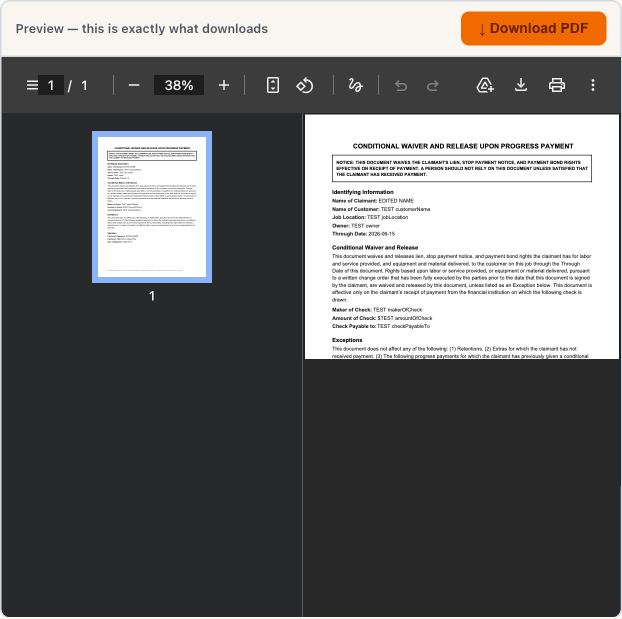

# WaiverFlow — Free Lien Waiver Generator (California, Texas & Florida)

**Fill in the statutory lien waiver PDF in 60 seconds. 100% in your browser. Nothing uploaded. No account. No $400/month platform.**

👉 **Live: [ipythoning.github.io/waiverflow](https://ipythoning.github.io/waiverflow/)**

Built for the long tail of **subcontractors and construction contractors** who run on
QuickBooks and Excel and just need to send a lien waiver to get paid — without buying
a GC-priced compliance platform (Siteline, GCPay, Flashtract, Levelset, Procore).



## What it does

Pick your **state → waiver type → fill the blanks → preview → download** a verbatim,
statute-accurate PDF. Everything runs client-side; your project, payment, and signature
data **never leave your browser**.

- Live inline **PDF preview** before you download — what you see is what prints.
- **Amount normalization** — type `1234.5`, it prints `$1,234.50` (no silent rounding of your numbers).
- **Date sanity hints** — flags future dates and a through-date that falls after the signature date (advisory only).
- **Contractor identity memory** — your company name/address is remembered locally, so the next waiver is faster.

## Coverage today

| State | Statute | Waiver types |
|-------|---------|--------------|
| **California** | Civil Code §8132 / §8134 / §8136 / §8138 | Conditional & Unconditional × Progress & Final (all 4) |
| **Texas** | Property Code §53.284(b) | Conditional progress |
| **Florida** | Statute §713.20 | Conditional & Final |

**Free.** No signup, no credit card, no trial wall. The whole point is that sending a
monthly lien waiver shouldn't require a four-figure annual subscription.

## Why this exists

Lien waiver compliance is a **monthly, recurring chore** for every subcontractor getting
paid on a construction project. The incumbents are priced and built for general contractors
and large subs. WaiverFlow is the deliberately **low-end, single-purpose** option: dead
simple, free, QuickBooks-friendly, and accurate to the statute.

## ⚠️ Legal posture (hard guardrails)

WaiverFlow renders a **document format only**. It does **not** provide legal advice, verify
your lien rights, auto-detect the "right" form, or guarantee compliance — you select the
state and waiver type and are responsible for confirming it against current statute.
Templates are reproduced verbatim and labeled with their statutory source.

> **DRAFT — templates pending construction-attorney review (CA + TX + FL) before public launch.**

## Stack

Vite + React 19 + TypeScript. PDF generation via `pdf-lib` (lazy-loaded, off the initial
bundle). Format/date validation is a pure-function module with unit tests (`tsx`, zero new
deps). Fully static — deployed on GitHub Pages. Backend (e-signing, status tracking,
accounts) intentionally deferred to Cloudflare Workers + D1 + R2 until there's demand.

## Develop

```bash
npm install
npm run dev          # local dev server
npm run build        # typecheck + production build
npx tsx scripts/verify.ts        # generate a sample PDF and validate the core chain
npx tsx src/validate.test.ts     # unit-test amount normalization + date hints
```

## Architecture

- `src/waivers/types.ts` — data-driven waiver model (states, types, declarative render blocks)
- `src/waivers/templates.ts` — the statutory template library (the core asset)
- `src/waivers/generatePdf.ts` — declarative `Block[]` → letter-size PDF renderer
- `src/validate.ts` — amount normalization + date sanity hints (shared by form preview and PDF)
- `src/App.tsx` — state → type → form → preview → download

Adding a state or waiver type means appending declarative data to `TEMPLATES` — no renderer changes.

---

### Maintainer notes

To unlock real search-traffic data, the site owner needs two one-time, 5-minute actions
(see `owner-onboarding-checklist.md` in the parent ops repo):

1. **Google Search Console** — paste the `google-site-verification` meta tag; the build
   injects it across all pages, then Verify + submit `sitemap.xml`.
2. **Bing Webmaster Tools** — one-click import from Search Console (IndexNow has been
   pushing URLs to Bing for 8+ cycles, so Bing likely already has data waiting).

Until then, GitHub repo signals (stars / forks / traffic) are the only AI-readable
distribution metric — this README is also the only AI-controllable landing page.

## Support

[](https://buymeacoffee.com/dayongfan)
